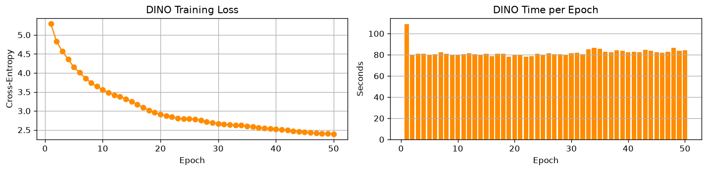
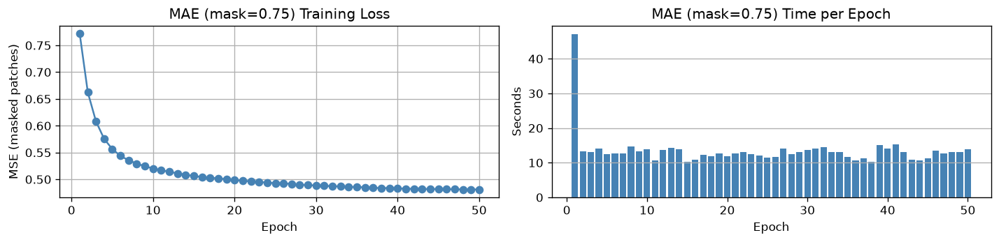
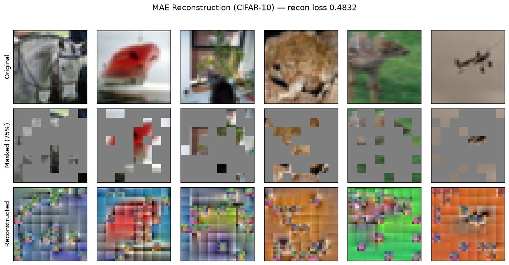
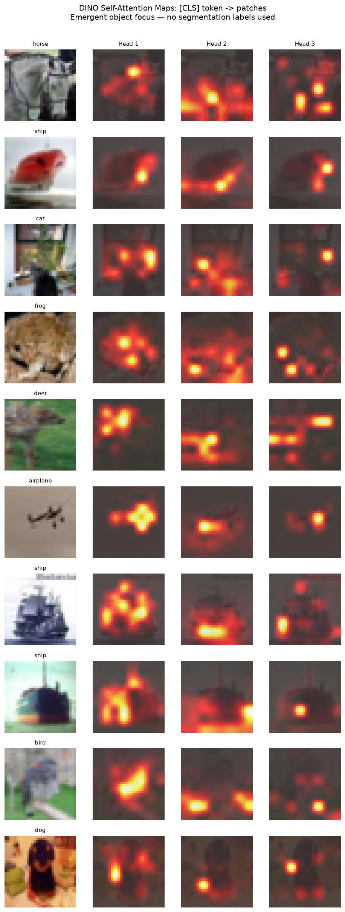
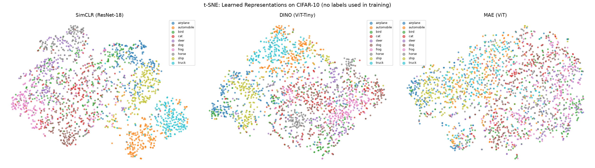
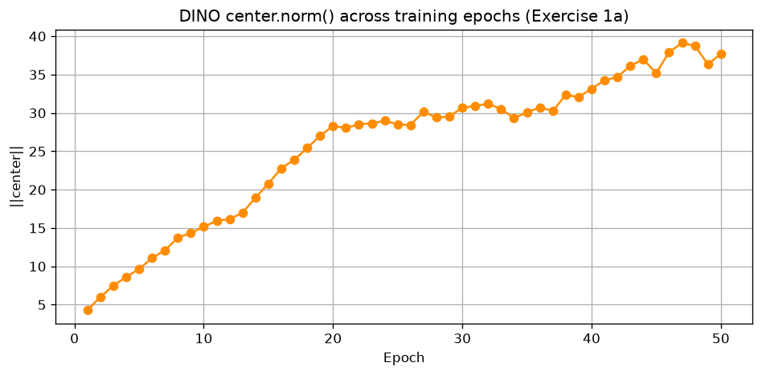
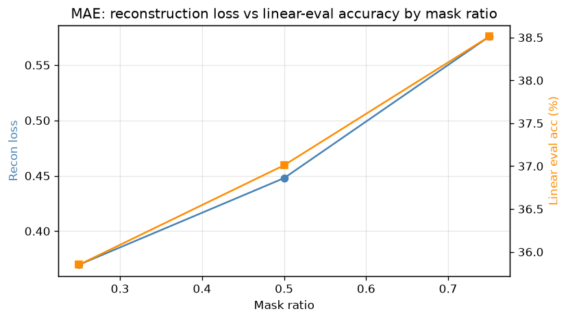
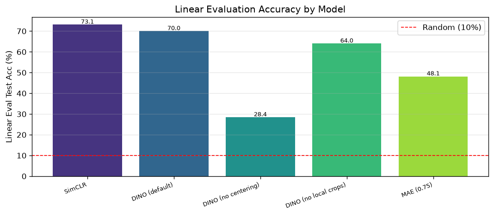

# A3 — Self-Supervised Learning (SimCLR · DINO · MAE)

DL-AIT Assignment 3 | Student: Dechathon Niamsa-ard [st126235]

Implementation and comparison of the three major self-supervised learning families
on CIFAR-10 — **SimCLR** (contrastive), **DINO** (self-distillation), and **MAE**
(masked reconstruction) — with the required ablations, visualizations, and analysis.
All models are pre-trained **without labels**; quality is measured by **linear
probing** (freeze the encoder, train a single linear layer with labels).

> Built on the class lab note (`lab_note/A3-Self-Supervised-Learning.ipynb`). Trained
> on an **NVIDIA RTX 5060 Ti** (Blackwell, `sm_120`) with PyTorch **cu128** + bfloat16
> AMP. Seeds fixed to 42 for reproducibility.

---

## Results

<!-- RESULTS_TABLE_START -->
| Model | Linear Eval Acc | Time/epoch | Notes |
|---|---|---|---|
| DINO (Default) | 70.01% | 82.2s | self-distillation (2 global + 4 local, centering) |
| DINO (no centering) | 28.42% | 110.4s | collapse ablation (loss→0, accuracy drops sharply) |
| DINO (no local crops) | 64.00% | 59.7s | multi-crop ablation (`n_local=0`) |
| MAE mask=0.75 | 48.14% | 13.4s | reconstruction — **main model, 50 ep** (5-ep ablation value is 38.51%, see Ex2) |
| MAE mask=0.50 | 37.01% | 20.3s | masking ablation (5 ep) |
| MAE mask=0.25 | 35.85% | 20.7s | masking ablation (5 ep) |
<!-- RESULTS_TABLE_END -->

*DINO variants & main MAE: 50 epochs; SimCLR: 30 epochs; MAE masking ablation: 5
epochs each (per the assignment). Full measured numbers — including SimCLR and the
three-way comparison — are in [results/results.json](results/results.json) and in the
notebook's exercise tables.*

---

## Visualizations

**Loss curves — DINO and MAE**




**MAE reconstruction grid** (original → masked 75% → reconstructed)



**DINO attention maps** — 10 images × all heads ([CLS] token → patches; emergent
object focus with no segmentation labels)



**t-SNE comparison** — SimCLR vs DINO vs MAE on CIFAR-10 test features



**DINO `center.norm()` across epochs** (Exercise 1a) · **MAE recon-loss vs accuracy
by mask ratio** (Exercise 2) · **linear-eval summary**





---

## Exercises — Answers

> Tables show the measured numbers from the full run (`results/results.json`); the same
> answers, with executed code and inline figures, are in the notebook.

### Exercise 1 — DINO variants

<!-- EX1_TABLE_START -->
| Setting | Linear Eval Accuracy |
|---|---|
| Default (2 global + 4 local, with centering) | **70.01%** |
| No centering (`- self.center` removed) | **28.42%** |
| No local crops (`n_local=0`) | **64.00%** |
<!-- EX1_TABLE_END -->

**1a) Does `dino_loss_fn.center.norm()` grow, shrink, or stabilize?**
It **grows** during the early epochs (from ~4.28 to a peak of ~39.13) and then
**stabilizes** (~37.69 by epoch 50) — see `figures/dino_center_norm.png`. The center
`c` is an EMA of the mean teacher logits; once the teacher's average output settles into
a stable, spread-out distribution the running mean stops drifting, so `||c||` plateaus
rather than growing without bound.

**1b) Why does removing centering cause collapse, and why does removing local crops hurt?**
*No centering → collapse.* Without negatives, the student's lowest-loss solution is to
copy one constant teacher distribution for every image. Centering subtracts the running
mean of the teacher logits before the softmax, so the instant one output dimension
starts to dominate across the batch, `c` grows in that dimension and cancels it, forcing
the distribution to stay spread across modes. Remove it and the teacher's sharp (τ=0.04)
softmax lets one dimension win for all inputs; the student matches that near-constant
target, the **training loss collapses to ≈0** (nothing learned) while the unconstrained
teacher logits — and `center.norm()` — blow up, and linear-eval accuracy drops from ~70%
to **28.42%**.
*No local crops → weaker features.* Multi-crop is DINO's main source of difficulty: the
student sees small **local** crops while the teacher sees the **global** view, so it must
infer global, object-level context from a part. Dropping the local crops removes this
local→global prediction signal and most of the augmentation diversity, leaving an easier
global-to-global matching task → less invariant, less semantic features (70.01% → **64.00%**).

### Exercise 2 — MAE mask-ratio ablation (5 epochs each)

<!-- EX2_TABLE_START -->
| Mask Ratio | Recon Loss | Linear Eval Acc |
|---|---|---|
| 0.25 | **0.3696** | **35.85%** |
| 0.50 | **0.4479** | **37.01%** |
| 0.75 | **0.5757** | **38.51%** |
<!-- EX2_TABLE_END -->

> **Note on the two MAE `0.75` numbers.** This ablation trains **all three** mask ratios
> for **5 epochs each** so they are compared apples-to-apples, so `0.75` here reads
> **38.51%**. The **48.14%** for `mask=0.75` in the *Results* and *Exercise 3* tables is the
> separate **50-epoch main MAE model** — same config, longer schedule. Both are correct;
> they differ only in epoch budget (5 vs 50). Reconstruction loss likewise rises with the
> mask ratio (harder task), which is expected and *not* a sign of worse representations.

**Why does very low masking (e.g. 0.25) give worse representations even though the reconstruction loss is lower?**
With only 25% of patches hidden, almost every masked patch has unmasked neighbours, so
the model reconstructs it by **locally interpolating / copying adjacent pixels** — a
low-level texture task. That keeps the per-pixel reconstruction loss small, but the
encoder never has to build a **global, semantic** understanding of the image, so its
features are poor for classification. At 75% masking the local shortcut disappears:
filling in the missing patches requires reasoning about object shape and context across
the whole image, producing stronger features. In short, **reconstruction loss measures
pixel-copying difficulty, not representation quality** — the two are anti-correlated here,
which is exactly why MAE uses an aggressive 75% mask. (The effect is modest at 5 epochs
but monotonic: 35.85% < 37.01% < 38.51%.)

### Exercise 3 — Three-way comparison

<!-- EX3_TABLE_START -->
| Metric | SimCLR | DINO | MAE |
|---|---|---|---|
| Backbone | ResNet-18 | ViT-Tiny | ViT |
| Needs negative pairs? | **Yes** | No | No |
| Needs EMA teacher? | No | **Yes** | No |
| Linear Eval Accuracy | **73.12%** | **70.01%** | **48.14%** |
| Training time/epoch | **19.9s** | **82.2s** | **13.4s** |
| t-SNE cluster quality (1–5) | 4 | 4 | 2 |
| Has interpretable attention maps? | No | **Yes** | No\* |
<!-- EX3_TABLE_END -->

\*Only **DINO** has *interpretable* attention — its self-distillation produces the famous
emergent object-segmentation maps. MAE is also a ViT so it technically has attention
weights, but they are not object-centric/interpretable out of the box, so it counts as
**No** here (matching the assignment's intent). *Column alignment: **SimCLR** is the only
method that needs explicit negative pairs (ResNet-18 backbone, no EMA teacher); **DINO** is
the only one with an EMA teacher; **MAE** needs neither.*

**3a) Two reasons MAE beat DINO for large-scale general pre-training; one reason DINO is still preferred for CV-only segmentation.**
1. **Simplicity & stability at scale** — MAE is a plain encoder–decoder with a single MSE
   loss: no EMA teacher, centering, multi-crop, or negative/temperature tuning. Nothing
   can collapse, there is far less to tune, and the encoder only processes 25% of tokens,
   so it scales cheaply and robustly.
2. **A general, modality-agnostic objective** — "mask and reconstruct" makes no
   vision-specific assumptions (the same recipe as BERT), so it transfers across
   modalities and pairs naturally with generative / multimodal pre-training.

*One reason DINO is still preferred for segmentation:* its self-distillation yields
**emergent, dense, object-centric attention** that localizes boundaries and foreground
with no labels and transfers directly to dense prediction (DINO/DINOv2 features are
widely used for segmentation), whereas MAE's pixel-reconstruction features are less
semantically organized out of the box.

**3b) Medical image segmentation with 500 labeled scans — which approach and why?**
I would pre-train a **DINO-style self-distillation** model on the large pool of
**unlabeled** scans, then fine-tune on the 500 labeled ones. With so few labels, what
matters is how segmentation-ready and label-efficient the frozen features are, and DINO's
emergent, dense, object-localizing representations are exactly that — strong
attention/feature priors that fine-tune well in low-label regimes and repeatedly top
low-data dense-prediction benchmarks. MAE is a reasonable alternative (its reconstruction
objective suits high-resolution medical images and needs no augmentation design), but its
features usually need more labeled data or heavier fine-tuning to reach the same
segmentation quality — the opposite of what a 500-scan budget allows.

---

## Discussion — medical image segmentation with limited labels (3–5 sentences)

For a medical-image **segmentation** project with only a handful of labeled scans, I
would pre-train with **DINO-style self-distillation** on the abundant *unlabeled*
scans and then fine-tune on the labeled set. DINO's training produces emergent,
dense, object-localizing attention and features — exactly the spatial, boundary-aware
signal that segmentation needs — without ever seeing a segmentation label. Those
features are unusually **label-efficient**, so they fine-tune well when only a few
hundred labels are available, whereas MAE's pixel-reconstruction features typically
need more labeled data or heavier fine-tuning to reach the same dense-prediction
quality. MAE remains a sensible alternative (its reconstruction objective suits
high-resolution medical images and needs no augmentation design), but under a tight
label budget DINO is the safer choice.

*(Full written answers to all exercises — including the corrected three-way
comparison table and the 2 + 1 reasons in Exercise 3a — are in the notebook.)*

---

## Repository structure

```
run.py             # assignment-compliant CLI (train / evaluate / --figures)
scripts.sh         # full reproduction (bash): drives run.py over the whole matrix
scripts.ps1        # full reproduction (Windows PowerShell)
src/               # reusable package (single source of truth)
  utils.py         #   seeding, device, paths, CIFAR constants, AMP
  data.py          #   SimCLR/DINO/MAE augmentations, datasets, loaders
  models/          #   simclr.py, dino.py (centering toggle), mae.py
  train.py         #   training loops (SimCLR / DINO / MAE)
  evaluate.py      #   frozen-encoder linear evaluation
  visualize.py     #   all plots
  pipeline.py      #   checkpoint save/load + feature extractors
notebooks/A3_Self_Supervised_Learning.ipynb   # self-contained notebook (code + answers + viz)
results/results.json   # all measured metrics (committed)
figures/*.png          # all visualizations (committed)
saved/*.pt             # checkpoints (git-ignored; reproduce with the commands below)
data/                  # CIFAR-10 cache (git-ignored)
lab_note/              # original class lab (reference)
```

---

## Setup

Requires [`uv`](https://docs.astral.sh/uv/) and an NVIDIA GPU with CUDA 12.8+ drivers
(RTX 50-series / Blackwell needs the `cu128` wheels, which `pyproject.toml` pins).

```bash
uv sync          # creates .venv (Python 3.12) and installs torch cu128 + all deps
```

Verify the GPU is used:

```bash
uv run python -c "import torch; print(torch.cuda.get_device_name(0), torch.cuda.is_available())"
```

## How to run

**Reproduce everything** (all models, ablations, linear eval, figures, `results.json`)
— these scripts just drive `run.py` over the full matrix and then build the figures:

```bash
bash scripts.sh                                   # Linux / macOS / Git Bash  (~3 h on an RTX 5060 Ti)
powershell -ExecutionPolicy Bypass -File scripts.ps1   # Windows PowerShell
```

**Single-model CLI** (the assignment's interface):

```bash
# Train
uv run python run.py --model dino --epochs 50 --train
uv run python run.py --model mae  --epochs 50 --train

# Linear evaluation
uv run python run.py --model dino --weights saved/dino.pt        --evaluate --linear
uv run python run.py --model mae  --weights saved/mae_encoder.pt --evaluate --linear

# Ablations
uv run python run.py --model dino --no-centering --epochs 50 --train
uv run python run.py --model dino --n-local 0    --epochs 50 --train
uv run python run.py --model mae  --mask-ratio 0.25 --epochs 5 --train
uv run python run.py --model mae  --mask-ratio 0.50 --epochs 5 --train

# Regenerate every figure from the saved checkpoints + results.json
uv run python run.py --figures
```

Every `--train` / `--evaluate` call records its metrics into `results/results.json`;
`--figures` rebuilds all plots from those. `run.py` also supports `--model simclr`
(three-way comparison) and `--batch-size --lr --seed --num-workers --amp/--no-amp`.

**Notebook:** open `notebooks/A3_Self_Supervised_Learning.ipynb`. With
`LOAD_PRETRAINED = True` (default) it loads the checkpoints produced by `scripts.sh` /
`scripts.ps1` and reproduces all tables/figures in minutes; set it to `False` to train
from scratch.
